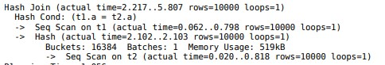

# Hash-join-in-PostgreSQL
Алгоритм выполнения INNER JOIN в PostgreSQL при использовании хэш-соединения

## **Описание алгоритма соединения таблиц, которое соответствует плану запроса**

На плане запроса представлено однопроходное соединение, значит у нас вся хэш таблица вмещается в выделенную оперативную память. Начнем с функции ExecutePlan, в которой используется цикл благодаря, которому осуществляется создание хэш-таблицы и проход по внешней таблице. Для создания хэш-таблицы используется меньшая таблица (внутренняя). Ниже я описал примерный алгоритм для однопроходного хэш соединения.

**ExecutePlan** ([postgres/src/backend/executor/execMain.c at master · postgres/postgres · GitHub](https://github.com/postgres/postgres/blob/master/src/backend/executor/execMain.c))

1. Цикл для обработки кортежа
    1. _ExecProcNode -> ExecHashJoin ->_ **_ExecHashJoinImpl_** _->_ _ExecProject_
    2. Проверка на NULL кортежа
    3. Отправка кортежа
    4. Счетчик количества кортежей

**ExecHashJoinImpl: (**[**postgres/src/backend/executor/nodeHashjoin.c at master · postgres/postgres · GitHub**](https://github.com/postgres/postgres/blob/master/src/backend/executor/nodeHashjoin.c)**)**

1. Получение информации из узла _HashJoin_
2. _ResetExprContext_ - Сброс контекста памяти для кортежей
3. **Бесконечный цикл для выполнения соединения в виде конечного автомата:**
4. _CHECK_FOR_INTERRUPTS_ - Обработка прерываний, например ввод от пользователя
5. **HJ_BUILD_HASHTABLE**: Состояние для создание хэш-таблицы
    1. _ExecHashTableCreate_ – создание хэш-таблицы. Выделение памяти и количество buckets ([postgres/src/backend/executor/nodeHash.c at master · postgres/postgres · GitHub](https://github.com/postgres/postgres/blob/master/src/backend/executor/nodeHash.c))
        1. _ExecChooseHashTableSize_ – вычисление размера хэш-таблицы ([postgres/src/backend/optimizer/path/costsize.c at master · postgres/postgres · GitHub](https://github.com/postgres/postgres/blob/master/src/backend/optimizer/path/costsize.c))
            1. _get_hash_memory_limit_ – вычисление ограничения размера хэш-таблицы в памяти ([postgres/src/backend/executor/nodeHash.c at master · postgres/postgres · GitHub](https://github.com/postgres/postgres/blob/master/src/backend/executor/nodeHash.c))
            2. Рассчитываем количество колизий в хэш-таблице, если их окажется достаточно, то расчитываем место под дополнительную хэш-таблицу
            3. Проверяем хватит ли места в памяти, чтобы поместить всю хэш-таблицу в память. Если не хватает выделяем несколько пакетов
        2. Вычисление количество корзин (buckets)
        3. Заполнение хэш-таблицы необходимыми параметрами
        4. _MemoryContextSwitchTo_ \- выделение данных, которые будут жить на протяжении всего срока выполнения хэш-соединения ([postgres/src/include/utils/palloc.h at master · postgres/postgres · GitHub](https://github.com/postgres/postgres/blob/master/src/include/utils/palloc.h))
    2. _MultiExecProcNode -> MultiExecHash_ – Построение хэш таблицы ([postgres/src/backend/executor/nodeHash.c at master · postgres/postgres · GitHub](https://github.com/postgres/postgres/blob/master/src/backend/executor/nodeHash.c))
    3. _MultiExecPrivateHash_ – заполняет хэш-таблицу значениями путём получения кортежей и расчёта по ним хэш-значений. ([postgres/src/backend/executor/nodeHash.c at master · postgres/postgres · GitHub](https://github.com/postgres/postgres/blob/master/src/backend/executor/nodeHash.c))
        1. Получение данных о хэш-таблице
        2. Бесконечный цикл для вставки всех кортежей в хэш таблицу
            1. _ExecProcNode -> ExecProcNodeFirst (при 1 проходе) ->ExecSeqScan -> ExecScan_ – проверяет, полученный кортеж из _ExecScanFetch -> seqNext -> table_scan_getnextslot_ ()
            2. Проверка кортежа на Null
            3. _ExecHashGetHashValue_ – вычисление хэш-значения для кортежа ([postgres/src/backend/executor/nodeHash.c at master · postgres/postgres · GitHub](https://github.com/postgres/postgres/blob/master/src/backend/executor/nodeHash.c))
            4. _ExecHashTableInsert_ – вставка в хэш таблицу кортежа и хэш-значения
            5. Счетчик кортежей
        3. Проверка на равенство оптимального и фактического количества корзин. Если значения не совпадают, то с помощью функции ExecHashIncreaseNumBuckets добавляются новые корзины. Для того чтобы уменьшить количество кортежей в корзине
    4. Изменение состояния node->hj_JoinState на HJ_NEED_NEW_OUTER
6. **HJ_NEED_NEW_OUTER :**
    1. _ExecHashJoinOuterGetTuple_ – Получение кортежа из внешней таблицы и вычисление его хэш-значения ([postgres/src/backend/executor/nodeHashjoin.c at master · postgres/postgres · GitHub](https://github.com/postgres/postgres/blob/master/src/backend/executor/nodeHashjoin.c))
        1. _ExecHashGetHashValue_ ([postgres/src/backend/executor/nodeHash.c at master · postgres/postgres · GitHub](https://github.com/postgres/postgres/blob/master/src/backend/executor/nodeHash.c))
    2. Проверка полученного кортежа на NULL
    3. _ExecHashGetBucketAndBatch_ – поиск соответствующих корзин и пакета для кортежа из внешней таблицы ([postgres/src/backend/executor/nodeHash.c at master · postgres/postgres · GitHub](https://github.com/postgres/postgres/blob/master/src/backend/executor/nodeHash.c))
    4. _ExecHashGetSkewBucket_ – проверка хэш-таблицы на принадлежность нескольких записей одному хэш-значению. Если есть такое хэш-значение и включена оптимизация, то возвращает номер новой корзины.
    5. Если кортеж NULL и пакета, то _hj_JoinState_ = _HJ_FILL_INNER_TUPLES._ Если кортеж NULL, то HJ_NEED_NEW_BATCH
    6. Изменение состояния _node -> hj_JoinState на HJ_SCAN_BUCKET_
7. **HJ_SCAN_BUCKET:**
    1. Сканирует корзину в поисках совпадения с кортежем из внешней таблицы. В случае не нахождения изменяет _node -> hj_JoinState_ на _HJ_FILL_OUTER_TUPLE_ и выходит из этой итерации цикла for.
    2. Проверяем на наличие условий и на соблюдение их
8. **HJ_FILL_INNER_TUPLES** \- гарантирует, что при несовпадении внешнего кортежа с внутренней таблицей, кортеж из правой таблицы будет включён в соединение (может пригодиться для RIGHT или FULL JOIN).
9. ExecProject – делает необходимую выборку параметров для передачи кортежа далее
10. **HJ_FILL_OUTER_TUPLE** – проверяет необходимо ли создавать пустой внешний кортеж, если во внутренней таблице не нашлось совпадений (может пригодиться для LEFT JOIN)
11. ExecProject

## **Описание существующей реализации хэш-таблицы**

  Хэш-таблица хранит данные в виде пар хэш-ключ и значение. Так за хранение значения отвечает структура _HashJoinTupleData_ ([postgres/src/include/executor/hashjoin.h at master · postgres/postgres · GitHub](https://github.com/postgres/postgres/blob/master/src/include/executor/hashjoin.h)). В ней хранится значение кортежа и указатель на следующий кортеж в корзине (bucket). Так основной структурой для использования хэш-таблицы является структура _HashJoinTableData_. Она имеет множество параметров, которые помогают эффективно пользоваться хэш-таблицей.
  
  Так в памяти может храниться 1 пакет (batch), данный пакет содержит корзины, которые содержат хэш-значения.  С помощью хеш-функции ключи хеширования распределяются случайно, но равномерно по ограниченному количеству корзин. Так количество корзин всегда равняется степени двойки
  
## **Описание, как обрабатываются значения Null при хэш-соединении**
  
  Null значение обрабатываются при hash соединении обрабатываются во время вычисления хэщ-значения для кортежей в функции _ExecHashGetHashValue (_[_postgres/src/backend/executor/nodeHash.c at master · postgres/postgres · GitHub_](https://github.com/postgres/postgres/blob/master/src/backend/executor/nodeHash.c)_)._
  
  ExecEvalExpr оценивает кортеж и если значение Null, то переменная isNull = True
  
  hashtable->hashStrict\[i\] = True так как выражение строгое, keep_nulls = False, следовательно в MultiExecPrivateHash полностью пропускаем вычисление хэша и добавление кортежа в таблицу. В ином случае вместо Null значения было бы возвращен 0. Значение keep_nulls зависит от типа соединения таблиц, так при INNER JOIN возвращается FALSE

    Код из функции _ExecHashGetHashValue:_
    
    &nbsp;       if (isNull)
    
    &nbsp;       {
    
    &nbsp;           if (hashtable->hashStrict\[i\] && !keep_nulls)
    
    &nbsp;           {
    
    &nbsp;               MemoryContextSwitchTo(oldContext);
    
    &nbsp;               return false;
    
    &nbsp;           }
    
    &nbsp;       }
